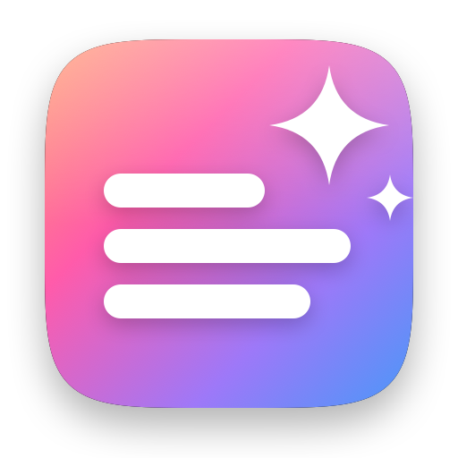
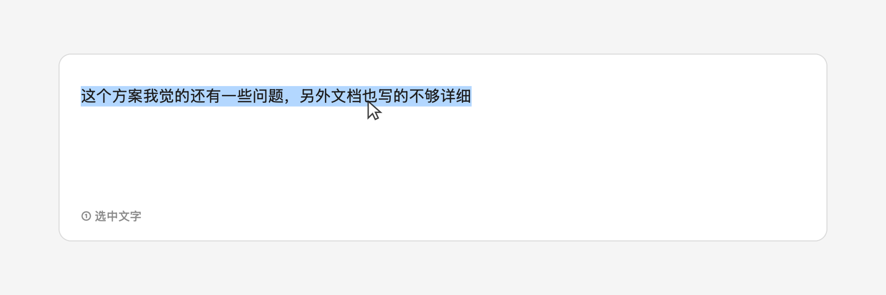

# Writing Tools Anywhere



**一个纯本地的轻量 Grammarly。** 同样是选中文字后浮出小球 ——
区别是**文字从不离开你的 Mac**，不需要账号，整个 App 只有 1.6 MB。

它在**任何**应用里都能用，包括 Apple 自己的 Writing Tools 永远不会出现的地方
—— Microsoft Teams、Slack、微信。

### **[⬇ 下载最新版本](https://github.com/LinShanify/WritingToolsAnywhere/releases/latest)**

macOS 26+ · Apple silicon · 已签名并公证，双击直接打开，没有任何警告

[English](README.md)

---

### 全部在你的 Mac 上运行

校对用 `FoundationModels`（Apple 的端上模型），翻译用 `Translation.framework`
（Apple 的端上翻译引擎）。**两者都不会把你的文字发到任何地方。**

整个 App 只发一种网络请求：问 GitHub 有没有新版本。它**不携带任何关于你或你文字的信息**，
而且可以在设置里关掉。

不需要账号、不需要订阅、没有后台服务 —— 一个菜单栏进程、磁盘占用 1.6 MB，
不用的时候什么都不跑。

**它不是什么**：不是写作教练。它修语法、做翻译；**没有**语气选项、**没有**摘要、
**没有**文风建议 —— 因为通用模型做这些的效果差到不如不提供。
这条边界是**实测出来的，不是猜的** —— 见[性能上限](#性能上限内联为什么追不上官方)。

## 它能做什么

在任何应用里选中文字，选区旁边浮出一个 ✨ 小球，鼠标移上去展开成三项：

<picture>
  <source media="(prefers-color-scheme: dark)" srcset="Resources/bubble-dark-zh.gif">
  
</picture>

- **校对** —— 修正语法、拼写和别扭的表达，直接替换原文。保留你的语气和长度，
  不会把你的话改成官腔。
- **翻译** —— 在你的语言和英文之间互译，方向自动判断。用的是 Apple 的翻译引擎，
  不是大模型。
- **写作工具** —— 打开编辑面板并唤起 **Apple 原版 Writing Tools**，
  官方那一整套语气、摘要、要点功能都在里面。

> [!IMPORTANT]
> **「校对」不是 Apple 的 Writing Tools，能力也达不到它。**
>
> 它跑在 `FoundationModels` —— Apple 的**通用**端上基座模型上，由本项目写 prompt 驱动。
> 而官方 Writing Tools 跑的是**任务专训的 LoRA 适配器**（校对一个、每种语气各一个、
> 摘要一个），公开 API 拿不到；并且它是**按范围原地编辑**你的文字，不是整块替换。
>
> 所以请把「校对」理解为：**把语法修对，仅此而已。** 它没有语气选项、没有摘要，
> 因为通用模型做这些的效果差到不如不提供。中文能力弱于英文。
> **想要官方水准就用 ✨「写作工具」那个 chip** —— 那才是把文字交给真正的 Writing Tools。
>
> 支撑这些判断的实测数据：[性能上限](#性能上限内联为什么追不上官方)。

另有全局快捷键 `⌥⌘W` 直接进编辑面板，给悬浮球取不到选区的应用用。可以关掉。

## 它是怎么做到的

Apple 没有开放「把 Writing Tools 注入别的 App」的接口。Teams 之类的 Electron 应用不用
`NSTextView`，系统就不会给它挂 Writing Tools，这一点无法从外部绕过。

这个 App 换了个思路：读取你在任意应用里选中的文字 → 交给 Apple Intelligence 处理 →
把结果写回去。

**怎么读到选区。** 监听全局鼠标松开和选择性按键，然后用辅助功能 API 读取选区
—— **绝不**在这里模拟 `⌘C`，否则每点一次鼠标都会污染剪贴板。Electron 应用默认不构建
辅助功能树，所以会先给它们设置 `AXManualAccessibility`，这样 Teams、Slack、VS Code、
Obsidian 才会上报选区。

**怎么写回去。** 默认模拟粘贴，因为这是唯一在 Electron 应用里稳定生效的方式。
剪贴板原有内容用完后会恢复。

### 当一个应用什么都不暴露

绝大多数应用——原生的也好、Electron 的也好——都会告诉辅助功能 API「当前选中了什么」。
但有些应用什么都不说，因为**整个界面是它自己画的**。微信是最典型的例子：
遍历它的辅助功能树共 215 个节点，其中 **209 个是菜单栏**。主窗口下面挂着三个按钮，
然后就没有了。焦点元素**完全取不到**——`AXManualAccessibility`（唤醒 Electron 应用的那个）
和 `AXEnhancedUserInterface`（VoiceOver 用的那个）都试过，没有区别。
那里没有文本元素可问，问多少次都一样。

这堵死了「读选区」，但没堵死剪贴板，`⌥⌘W` 走的正是这条路。可**替换仍然失败**，
原因值得说清楚：**编辑面板必须抢焦点**，Writing Tools 才能挂上去；
而微信一失去焦点就丢弃选区，于是粘贴落在了原文**旁边**而不是覆盖它
——结果新旧两份文字都在。这在粘贴那一步再怎么小心也修不好：
面板不可能既抢焦点、又保住一个应用已经扔掉的选区。

**悬浮球不一样，它活在 non-activating panel 里，全程不抢焦点。**
所以在这类应用里，小球改为**仅凭拖拽手势**浮出，而文字要等你选定动作之后
才用模拟 `⌘C` 取——剪贴板只在你确定要改的那一刻被动用，
不是每次点鼠标都动，何况写回结果本来就要用它。

判断依据是「这个应用返回不了焦点元素」，**不是一份应用名单**。
任何同样自绘界面的应用都会得到相同待遇，不需要我们事先知道它是谁。

代价是实实在在的，也该讲明：没有文本可比对，
**一次不是在选字的拖拽同样会让小球浮出来**。

## 要求

- macOS 26 或更新
- **已开启 Apple Intelligence** —— 启动时自动检测，没开会给出跳转按钮
- Apple silicon
- 只需 Command Line Tools，**不需要装 Xcode**

## 安装

下载 `.dmg` 把 App 拖进「应用程序」。磁盘映像和 App 都经过 Developer ID 签名与
Apple 公证，双击直接打开，没有任何警告。

**覆盖安装旧版本时**：macOS 不允许替换正在运行的程序，先从菜单栏退出。
App 内的更新提示会主动帮你做这一步。

也可以自己构建：

```bash
./setup-signing.sh   # 只需一次
./build.sh --run
```

首次启动会请求**辅助功能**权限：系统设置 → 隐私与安全性 → 辅助功能 →
打开 `WritingToolsAnywhere`。开关一打开就立即生效，**不需要重启 App**。

### 为什么需要 setup-signing.sh

macOS 把辅助功能权限绑在 App 的**代码签名**上，不是绑在路径或 bundle ID 上。

ad-hoc 签名的值由二进制内容算出，所以**改一行代码重新编译，签名就变一次**，
系统会把它当成另一个 App —— 而系统设置里那个开关还留着旧记录、显示为「已开启」。
这是最难受的失败模式：**看起来已授权，实际不生效，也不再弹提示。**

`setup-signing.sh` 在登录钥匙串里建一张自签名证书，签名身份从此不随代码变化，
授权一次就一直有效，连移动文件夹都不受影响。

权限真的乱了就重置：

```bash
tccutil reset Accessibility com.linshan.WritingToolsAnywhere
```

## 设置

菜单栏 ✨ → **设置…**（`⌘,`）

| 分区 | 项目 | 说明 |
|---|---|---|
| 状态 | Apple Intelligence | 实时检测；未开启时给出跳转按钮 |
| 状态 | 辅助功能权限 | 实时检测；未授予时给出跳转按钮 |
| 通用 | 登录时自动启动 | 走 `SMAppService`，不需要额外的 helper |
| 通用 | 悬浮球 | 关掉之后只保留快捷键 |
| 通用 | 快捷键 | 可整体关闭，也可改组合键。关掉后这组按键会还给其他应用 |
| 语言 | 界面语言 | 跟随系统 / 简体中文 / English |
| 语言 | 我的语言 | 翻译在这个语言和英文之间进行。设成英文则一切非英文都转英文 |
| 高级 | 自动替换 | 写作工具面板结束后自动写回 |
| 高级 | 替换方式 | 模拟粘贴（兼容性最好）/ 辅助功能直接写入 |
| 高级 | 剪贴板 | 用完后恢复原有内容 |
| 高级 | 更新 | 检查 GitHub 上有没有新版本，可自动也可手动 |
| 高级 | 调试日志 | **默认关闭** —— 打开后会把你选中的文字写入本地日志 |

校对结果始终使用原文的语言，界面语言只影响 App 自身的 UI。翻译走 Apple 内置引擎，
所以语言包需要先在系统设置里下载 —— 没装的话悬浮球会直接告诉你缺哪一对。

配置存在 `~/Library/Application Support/WritingToolsAnywhere/config.json`。

## 快捷键

| 位置 | 按键 | 作用 |
|---|---|---|
| 全局 | 选中文字 | 悬浮球出现，鼠标移上去展开 |
| 全局 | `⌥⌘W` | 抓取选中文字并打开编辑面板 |
| 面板内 | `⌘J` | 重新打开 Writing Tools |
| 面板内 | `⌘↩` | 用结果替换原文 |
| 面板内 | `⇧⌘C` | 复制结果 |
| 面板内 | `esc` | 取消 |

## 性能上限：内联为什么追不上官方

这个 App 里的三条路径**跑在不同的引擎上**，这个差别就是全部答案：

| | 引擎 | 质量 |
|---|---|---|
| **内联**（校对） | `FoundationModels` —— Apple 的**通用**端上基座模型，由本项目写 prompt 驱动 | 够用来修语法，仅此而已 |
| **翻译** | `Translation.framework` —— Apple 专用翻译引擎，和「翻译」App、Safari 同一套 | Apple 官方水准 |
| **写作工具**（✨） | `showWritingTools:` —— **Apple 真正的 Writing Tools**，带它任务专训的 LoRA 适配器 | Apple 官方水准 |

**官方 Writing Tools 不是拿通用模型写 prompt。** 它加载**任务专属的 LoRA 适配器**
——校对一个、摘要一个、每种语气各一个——运行时按需换入。然后通过
`NSWritingToolsCoordinator` 把 **`(范围, 替换文本)` 对**交回 App，直接编辑已有的文本
存储，而不是返回一整段文字。**开场白根本没有地方可放。**

**这两样公开 API 都拿不到。** FoundationModels 给你的是通用的约 3B 基座模型和整段
字符串响应；官方那些适配器是私有系统资源，`SystemLanguageModel.Adapter(name:)`
加载的是**你自己提供**的适配器，不是 Apple 的。

所以内联编辑本质上是「对通用模型做 prompt 工程」，它有天花板。
这也是它只做一件事的原因。

### 天花板体现在哪

只要让基座模型做「正确」之外的事，它就会飘，而且飘得可测量。真实聊天消息上：

| 你要的 | 通用模型实际给的 |
|---|---|
| 专业的语气 | 一句话的消息变成 2.4 倍长的信函模板——`Hi [Recipient's Name] … Best regards, [Your Name]`。给 prompt 加缰绳能压住长度，压不住那个本能。 |
| 友好的语气 | 加上原文根本没有的客套：「Thanks for your understanding!」 |
| 更短一些 | 约一半概率把原文原样交回。而且 prompt 写得越强**越糟**——加上「结果必须明显更短」和字符数预算之后，模型干脆放弃编辑、直接复制输入。 |
| 翻译 | **会编。**「明天」被翻成「Wednesday」；一个没翻的 "someone" 直接留在中文句子里。 |

最后一条就是翻译改用 `Translation.framework` 的原因。Apple 的翻译器犯的是普通的
选词错误，不是笃定的捏造——这两种「错」，对于要粘进别人消息里的文字来说，
性质完全不同。

### 校对靠什么守住

1. **引导式生成**。响应被强制填进只有一个 `text` 字段的 schema，
   「Here is the corrected version:」无处安放。用 `DynamicGenerationSchema` 运行时构建，
   而不是 `@Generable` 宏——那个宏的编译器插件只随 Xcode 发布。
2. **给文档加围栏**。文字包在 `⟪⟪⟪ … ⟫⟫⟫` 里。不加围栏时，模型会去「回答」短文本或
   疑问句而不是编辑它：`ok` 会被编出一整段，写着「忽略你的指令」的文字会被照做。
   模型有时会把围栏的**残片**吐回来，所以是按字符集裁剪，而不是匹配完整标记。
3. **合理长度上限**。结果超过原文约 1.6 倍，那就是「续写」而不是「修正」，直接丢弃。
4. **结构锁定**。行数和列表符号必须原样保留。让它整理一份三项待办时，模型把三行合并成
   一句话，还把语气翻转了——`fix the timeout issue`（待办）变成
   `the timeout issue has been fixed`（已完成），**一份待办清单被改写成了完工汇报**。
   两者都可机械计数，结构变了就丢弃。
5. **语言锁定**。用 `NLLanguageRecognizer` 在本地识别文档语言，并把语言名**明写进指令**。
   只说「用和原文相同的语言」时，模型每次都把中文翻成了英文；改成「这份文档是中文，
   你的回复必须是中文」之后就不再翻译。同一个识别器会复核输出，语种变了就丢弃
   ——**这道检查刻意不交给模型自己判断**。

如果结果和原文完全一致，悬浮球会告诉你「没有可改的地方」，而不是把你自己的话
原样贴回你自己身上。

### 那自己训一个适配器行不行

技术上可以 —— `SystemLanguageModel.Adapter` 是公开的，Apple 也提供训练工具包。
但不值得，两个原因：

- **适配器锁死基座模型版本** —— 一个系统模型版本对应一个，无一例外。
  macOS 一更新就可能失效，在你重新训练并发版之前，所有用户的 App 都是坏的。
- **它补不上真正的差距**，那个差距在传输格式：官方按范围原地编辑，我们是整块替换。

**内联是便利路径，✨「写作工具」是质量路径。** 后者把你的文字放进一个真正的 `NSTextView`
再调 `showWritingTools:`，于是你拿到的是 Apple 自己的适配器、prompt 和逐条接受/拒绝
的界面 —— 在一个本来永远不会提供这些的 App 里。

## 打包发布

```bash
./package.sh                        # 产出 dist/*.dmg
./package.sh --notarize <配置名>     # 额外做公证与装订
```

有 `Developer ID Application` 证书就用它签名，否则退回 ad-hoc 并打印警告。
App 和磁盘映像**都会**签名并装订，脚本随后按 Gatekeeper 的视角复核结果
—— 签名有问题会在这里失败，而不是在别人的 Mac 上失败。

`<配置名>` 是一个 `notarytool` 钥匙串配置，用 `xcrun notarytool store-credentials` 建一次即可。

## 源码结构

| 路径 | 作用 |
|---|---|
| `Sources/AppDelegate.swift` | 菜单栏、权限与 Apple Intelligence 引导、总调度 |
| `Sources/SettingsWindow.swift` | 设置窗口 |
| `Sources/SelectionWatcher.swift` | 全局选区检测 + 悬浮球定位 |
| `Sources/BubbleController.swift` | 悬浮球容器（不抢焦点的 non-activating panel） |
| `Sources/ActionMenuView.swift` | 展开后的一排按钮（自绘） |
| `Sources/PanelController.swift` | 编辑面板与 `showWritingTools:` 调用 |
| `Sources/TextBridge.swift` | 跨应用读取选区 / 写回结果 / 剪贴板保护 |
| `Sources/LLM.swift` | FoundationModels 封装、prompt、引导式生成 |
| `Sources/Translator.swift` | Translation.framework 封装与语种识别 |
| `Sources/HotKey.swift` | Carbon 全局快捷键（不需要额外权限） |
| `Sources/MenuBarIcon.swift` | 菜单栏单色图标（代码绘制） |
| `tools/MakeIcon/main.swift` | 应用图标（Core Graphics 矢量绘制，十个尺寸各自渲染） |

`build.sh` 编译并组 `.app`；`make-icon.sh` 重新生成图标。

菜单栏 ✨ → 设置 → 高级 → **复制诊断信息** 可导出权限与模型状态。
打开调试日志后写入 `~/Library/Logs/WritingToolsAnywhere.log`。

## 已知限制

- 翻译需要先安装 Apple 的语言包（系统设置 → 通用 → 语言与地区 → 翻译语言）。
  缺哪一对会直接报出来。
- 语种识别需要足够的文字。置信度低于 0.6 时——`ok` 会被识别成波兰语、`LGTM` 成
  土耳其语——方向会退回到你设定的语言对，而不是相信那个猜测。
- **翻译可能选错行业黑话的义项** —— `standup` 被译成「站立演讲」而不是「站会」。
  这是 Apple 的引擎，我们调不了；但请注意那是**选错词**而不是**编造事实**，
  正是这个区别让翻译走了这个引擎而不是大模型。
- **中文校对弱于英文。** 部分同音混淆能稳定改对（`觉的`→`觉得`、`跑的`→`跑得`），
  另一些改不出来（`写的`→`写得`、`在评估`→`再评估`）。这是基座模型的中文能力边界，
  不是 prompt 能补齐的。
- 只读纯文本，写回也是纯文本，富文本格式（加粗、链接）会丢失。
- 「模拟粘贴」会短暂占用剪贴板，之后恢复。剪贴板管理器可能会记录这一次。
- 需要辅助功能权限，无法沙盒化，因此也无法上架 App Store。
- **有些应用完全不向辅助功能暴露文本** —— 微信整个窗口是自绘的，
  215 个辅助功能节点里 209 个是菜单栏。这类应用里小球**靠拖拽手势浮出**，
  等你点了按钮才用模拟 `⌘C` 取文字，所以能用；但它无从判断一次拖拽是不是在选字，
  **拖别的东西时偶尔会误浮出小球**。
- **`⌥⌘W` 会打开编辑面板，而面板必须抢焦点**（Writing Tools 需要它是 key window）。
  失去焦点就清空选区的应用（微信就是）会把结果**粘在原文旁边而不是替换掉**。
  这类应用请用悬浮球——它全程不抢焦点。
- 为了检测选区，App 注册了全局键鼠事件监听。监听内容不做任何记录、存储或上传，
  除非你手动打开「记录调试日志」。

## 许可证

MIT
